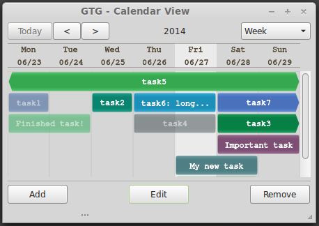

Calendar Plugin for GTG
=======================
A plugin to display a calendar view for [Getting Things GNOME!](http://gtgnome.net/)



At this stage, the plugin is completely independent from GTG, but
the goal is to integrate them once it is complete.


How to run
-----------

### Get the code

Clone a copy of the git repo by running:
```sh
  git clone https://github.com/sararibeiro/calendar-plugin.git
  cd calendar-plugin
```

### Dependencies
Before being able to run, make sure you have the following dependencies
installed:

- Python, version 3.0 or above
- GTK 3
- python-cairo

### Running
Make sure you have execute permission, and then run it. Use the following commands:
```sh
  chmod +x calendar-plugin.py
  ./calendar-plugin.py
```

Authors
-------

[Sara Ribeiro](http://www.dcc.ufmg.br/~sara) is developing this plugin as an
intern of the GNOME Outreach Program for Women, having Izidor Matušov as the
mentor of the project.

More information about it can be found [here](https://wiki.gnome.org/GnomeWomen/OutreachProgram/2014/MayAugust/Projects/SaraRibeiro_GTGCalendar)
or in the author's [blog](http://www.sararmgr.wordpress.com).
